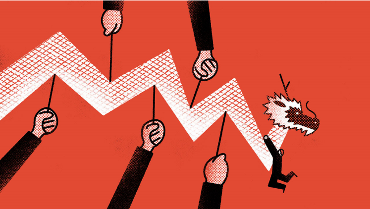

# Why investors should still avoid Chinese stocks

The debate about “uninvestability” obscures something important

原文：

**N**OTHING CHANGES sentiment like price, according to one

investing maxim. The world-weary saying reflects the fact that

after a stockmarket surge speculators usually scramble for reasons

to believe further price rises are on the way. A recent surge in the

Chinese market is one such example.

根据一条投资格言，没有什么比价格更能改变情绪。这种厌世的说法反映了一个事实，即在股市暴涨之后，投机者通常会寻找理由相信价格将进一步上涨。中国市场最近的飙升就是这样一个例子。

学习：

world-weary：厌世的；对世界感到厌倦的；疲惫的

>
>
>**"World-weary" 的含义**  
>
>**"World-weary"** 描述一种对生活感到疲惫、失望或沮丧的状态，通常源于经历了太多的挫折或失望。这个词传达了对人类经验的无奈和疲惫感。
>
>---
>
>**例句**：
>
>- After years of working long hours, she felt world-weary and ready for a change.  
>（经过多年的加班，她感到疲惫不堪，准备改变。）
>- His world-weary demeanor suggested he had seen it all.  
>（他那疲惫的神情暗示他经历了所有。）
>
>---
>
>**在本文中的意思**：
>
>> **"The world-weary saying reflects the fact..."**  
>> 意思是：这个**充满疲惫感的说法反映了**投资者经历过市场波动后的情绪，暗示他们对价格变化的敏感和理解。这种疲惫感可能源于对市场的长期观察和对投资结果的不确定性。
>
>---
>
>**总结**  
>
>使用 **"world-weary"** 来形容这种说法，强调了投资者在面对市场波动时，常常会感到疲惫和怀疑，同时也反映出他们对市场情绪变化的敏感和无奈。

speculators：投机者；（speculator的复数）          

scramble for：争夺；争抢          

原文：

On September 13th the CSI 300 index, made up of the largest

stocks listed in Shanghai and Shenzhen, was at its lowest in five

years. Since then it has gyrated wildly, rising by as much as 35%

and then falling by 11%. Stocks are being buffeted by waxing and

waning expectations for stimulus from the central bank and the

government. On October 12th China’s finance ministry pledged

that it would boost consumption and shore up support for

struggling local governments, although it fell short of putting a

precise figure on such spending.

9月13日，由在上海和深圳上市的最大股票组成的沪深300指数跌至五年来的最低点。从那以后，它开始疯狂地起伏，上涨了35%，然后下跌了11%。由于对央行和政府刺激措施的预期时好时坏，股市受到了冲击。10月12日，中国财政部承诺将刺激消费，支持苦苦挣扎的地方政府，尽管没有给出这类支出的准确数字。

学习：

gyrated：旋转；（gyrate的过去式和过去分词）；

buffet：连续猛击

waxing and waning：盛衰，时好时坏

shore up：支撑；撑起；撑住

原文：

So has a new dawn broken over Shanghai and Shenzhen? Investors

would desperately like an end to three years of misery, during

which time Chinese stocks have been battered by a property crisis,

the government’s turn against parts of the private sector and an

increasingly fraught relationship between Beijing and Washington.

A debate about whether Chinese stocks are in reality

“uninvestable” has roiled since 2022, when JPMorgan Chase, a

bank, published (and subsequently withdrew) a briefing note

suggesting as much.

那么，上海和深圳是否迎来了新的曙光？投资者迫切希望结束三年的痛苦，在此期间，中国股市受到房地产危机、政府转向反对部分私营部门以及北京和华盛顿之间日益紧张的关系的打击。自2022年以来，一场关于中国股票是否真的“不可投资”的辩论一直在进行，当时摩根大通银行发布了一份简报(随后撤回)暗示了这一点。

学习：

battered：经历重击的；受到重创的

fraught relationship：紧张关系

原文：

What it means for a stockmarket to be uninvestable has always

been a little uncertain. JPMorgan did not intend for its provocative

turn of phrase to refer to the Chinese market in perpetuity. Alex

Yao, the analyst responsible, was referring to a particular moment

of political uncertainty, which he and his colleagues expected to

last for 6-12 months. This year he has been much more optimistic

about the country’s tech firms.

股票市场的不可投资性意味着什么一直有点不确定。摩根大通并不打算用这种挑衅性的措辞来永久指代中国市场。负责的分析师Alex Yao指的是一个特殊的政治不确定性时刻，他和他的同事预计这一时刻将持续6-12个月。今年，他对该国的科技公司更加乐观。

学习：

provocative：挑衅的；挑拨的；

perpetuity：英 [pəːpɪˈtjʃuːɪti] 永久；永恒；不朽

原文：

Some investors are undoubtedly finding the market investable.

Chinese equity funds saw their largest recorded inflows in the week

ending October 9th, according to EPFR, a data provider, with

almost $40bn flooding in from investors at home and abroad.

Moreover, there is plenty of room for foreign allocations to grow.

Goldman Sachs, another bank, believes that were allocations to

return to levels proportional to the size of the Chinese stockmarket,

it would mean another $48bn flowing into the country.

一些投资者无疑发现这个市场值得投资。数据提供商EPFR的数据显示，在截至10月9日的一周，中国股票基金出现了有记录以来的最大资金流入，来自海内外投资者的资金接近400亿美元。此外，外国投资者的配置还有很大的增长空间。另一家银行高盛(Goldman Sachs)认为，如果配置回到与中国股市规模成比例的水平，这将意味着另外480亿美元流入中国。

原文：

New arrivals will also find Chinese stocks to be far more

investable, in the technical sense, than they have been previously.

In July 85 exchange-traded funds that are listed on the mainland

were made available through the Stock Connect system, which

links mainland exchanges with Hong Kong. The quotas and limits

on purchases of stocks by so-called qualified investors were

removed four years ago, and recent rule changes have made

hedging currency risk easier, too.

新来者还会发现，从技术角度来看，中国股票比以前更具投资价值。今年7月，85只在内地上市的交易所交易基金通过连接内地交易所和香港的沪港通系统上市。所谓的合格投资者购买股票的配额和限制在4年前被取消，最近的规则变化也使对冲汇率风险变得更加容易。

原文：

But the question for most investors is simpler: is buying Chinese

stocks a good idea? Even as speculators reap quick returns, for

those who wish to buy and hold the answer is clearly still “no”.

但对大多数投资者来说，问题更简单:购买中国股票是个好主意吗？即使投机者迅速获利，对于那些希望购买并持有的人来说，答案显然仍然是“不”。

原文：

Whatever the deeper problems with Chinese markets, a lack of

economic growth is not among them. In fact, mainland stocks have

been an abysmal way to benefit from the astonishing growth of the

world’s second-largest economy. The CSI 300 index has risen by

less than a quarter in the past 15 years, while China’s nominal GDP

has quadrupled.

无论中国市场存在什么更深层次的问题，经济增长乏力都不在其中。事实上，从全球第二大经济体的惊人增长中获益，中国内地股市一直是一种糟糕的方式。沪深300指数在过去15年里上涨了不到四分之一，而中国的名义GDP却增长了3倍。

学习：

abysmal：美 [əˈbɪzməl] 极糟的；极差的；

原文：

The deeper problems include poor corporate governance, a high

share of state-owned firms and the government’s habit of

blindsiding investors with policy shifts. A campaign in 2021

against firms in education and technology was one such shift.

Officials have made encouraging noises about the private sector

recently, but it is hard to be confident there are no more value

destroying campaigns in the offing—a situation that cannot be

resolved by stimulus and a burst of consumption growth.

更深层次的问题包括糟糕的公司治理，国有企业的高份额，以及政府习惯于在政策转变时蒙蔽投资者。2021年反对教育和科技公司的运动就是这样一个转变。官员们最近对私营部门发出了令人鼓舞的声音，但很难确信未来不会出现更多破坏价值的运动——这种情况无法通过刺激和消费增长的爆发来解决。

学习：

in the offing：即将发生；在不远的将来；即将到来

原文：

Even recent improvements in market conditions demonstrate this

point. Reading the runes for changes in policy is an all-important

skill when investing in a country with a closed-off political system.

For investors who get such Kremlinology correct, the rewards can

be enormous. Yet most will never manage to do so, and will lose

money trying.

甚至最近市场状况的改善也证明了这一点。在一个政治体系封闭的国家投资时，解读政策变化是一项非常重要的技能。对于那些在克里姆林宫学上如此正确的投资者来说，回报可能是巨大的。然而，大多数人永远也不会成功做到这一点，而且会因为尝试而赔钱。

学习：

all-important：极重要的；至关重要的；关键的；决定性的          

原文：

Perhaps it would be better if the debate about the uninvestibility of

Chinese stocks was retired. Its terms are unclear and, in some

ways, China is becoming more accessible. Still, that does not

change the most simple—and most important—analysis. For most

potential buyers, Chinese stocks are simply not a worthwhile

investment. ■

如果有关中国股票不可投资性的辩论停止，或许会更好。它的条款还不清楚，而且在某些方面，中国正变得越来越容易接近。然而，这并没有改变最简单也是最重要的分析。对于大多数潜在买家来说，中国股票根本不值得投资。■

## 后记

2024年10月23日14点32分于上海。

