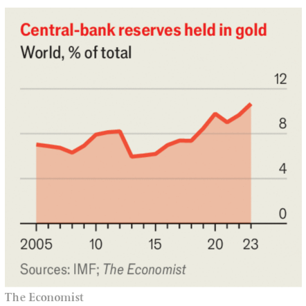

# The blistering rally in gold augurs ill for the power of the dollar

Central banks are shifting away from the greenback

blistering：有力的；强烈的；猛烈的；迅速的

rally：上涨

augur：美 [ˈɔɡər]  预示；预兆；

augur ill for： 对...是不祥的预兆

greenback：美钞（尤指19世纪的美国纸币）          

原文：

**N**OT LONG ago gold seemed to have lost its lustre. In the decades

after President Richard Nixon abandoned the gold standard in

1971, the yellow metal fell out of favour with central banks, which

hoarded their reserves in dollars instead. In the 1980s and 1990s

investors and households grew weary of its miserly returns.

Goldbugs were dismissed as eccentric doom-mongers. Gold was

alluring when forged into a shiny bauble and useful in specialist

manufacturing, but it was hardly a serious financial asset.

不久前，黄金似乎失去了光泽。在理查德·尼克松总统于1971年放弃金本位制后的几十年里，黄金不再受各国央行青睐，各国央行转而以美元储备。在20世纪80年代和90年代，投资者和家庭对其微薄的回报感到厌倦。支持黄金投资的人被看作是异类和悲观主义者。当黄金被锻造成闪闪发光的小玩意并在专业制造业中发挥作用时，它颇具吸引力，但它算不上是一种重要的金融资产。

学习：

lustre：英 [ˈlʌstə] 光泽；光彩

gold standard：金本位；

hoarded：囤积；贮藏；（hoard的过去式）          

weary of：厌烦；疲倦；对…失去兴趣          

miserly：吝啬的；小气的；极少的；微小的          

bauble：美 [ˈbɔbəl] 小玩意儿；廉价珠宝；花哨的饰品；

>
>
>"Goldbugs were dismissed as eccentric doom-mongers" 的含义  
>在这段话中，"dismissed" 指的是人们对“金虫”（Goldbugs）持否定态度，不将他们的观点认真对待。金虫是指那些极度看好黄金的人，他们通常认为黄金是最可靠的投资，而“doom-mongers”则指那些对未来持悲观态度的人，预言灾难的人。
>
>例句：  
>- The committee dismissed the proposal as impractical.
>（委员会认为该提案不切实际，因此不予考虑。）
>
>在本文中的意思：  
>"Goldbugs were dismissed as eccentric doom-mongers"  
>意思是：那些极力支持黄金投资的人被视为古怪的灾难预言者，表示他们的观点在当时并不被主流接受。
>
>总结  
>这句话强调了在1971年之后，黄金在金融界的地位下降，支持黄金投资的人被看作是异类和悲观主义者，反映出对黄金投资的普遍怀疑和贬低。

原文：

How it glitters now. Its price has soared· by a third since the end of

2023, reaching an all-time high of almost $2,750 per troy ounce.

The rush has been fuelled by war, inflation and fiscal profligacy

around the world, which have drawn in family offices and Costco

shoppers.

现在它是多么闪亮。自2023年底以来，金价已飙升三分之一，达到每金衡盎司近2750美元的历史最高水平。全球的战争、通胀和财政挥霍助长了这股热潮，吸引了家族理财室和好市多(Costco)购物者。

学习：

glitters：灿烂；（glitter的复数）；闪烁；（glitter的第三人称单数）          

原文：

Yet perhaps no buyers have been as voracious as the world’s central

banks, which have hoovered up hundreds of tonnes of the stuff over

the past two years. Gold now makes up 11% of their reserves, up

from 6% in 2008. This shift brings with it important consequences

for America’s dominance of the global financial system. Even as

the dollar remains unchallenged as the world’s reserve currency, its

power is diminishing.

然而，也许没有哪个买家像世界各国央行那样贪婪，它们在过去两年里已经购买了数百吨黄金。黄金现在占其储备的11%，高于2008年的6%。这一转变给美国在全球金融体系中的主导地位带来了重要后果。尽管美元作为世界储备货币仍未受到挑战，但它的力量正在减弱。

学习：

voracious：美 [vəˈreɪʃəs] 贪婪的；贪吃的

hoover up： 迅速而大量地吸收或购买某物

> "Hoovered up" 的含义  
> 在这段话中，"hoovered up" 是一个俚语，表示迅速而大量地吸收或购买某物，就像真空吸尘器（Hoover）那样高效。这里指的是各国中央银行大量购买黄金。
>
> 例句：  
> - The company hoovered up all the available resources to complete the project.
> （公司迅速吸收了所有可用资源以完成项目。）
>
> 在本文中的意思：  
> "have hoovered up hundreds of tonnes of the stuff"  
> 意思是：中央银行在过去两年中大量购买了数百吨黄金，显示出它们对黄金的需求非常强劲。
>
> 总结  
> "Hoover up" 强调了中央银行在购买黄金时的积极和大量行为，反映了全球金融环境的变化及其对美国金融体系主导地位的影响。	

原文：

For some central banks, the interest in gold reflects anxiety about

the state of the world. Others have a narrower concern: that their

reliance on the dollar, always uncomfortable and annoying, has

become dangerous. Buying has been enthusiastic in China, India

and Turkey, and it began to ratchet up in the spring of 2022, after

Russia invaded Ukraine, and America and its allies sought to

cripple Russia financially, using sanctions. These included freezing

some $280bn in state assets held overseas, and kicking Russian

banks off SWIFT, an interbank messaging service crucial for

making cross-border payments. Visa and Mastercard, American

firms which process debit- and credit-card transactions in almost

every country in the world, pulled out of Russia, too.

对一些央行来说，对黄金的兴趣反映了对世界状况的担忧。其他人有一个更狭隘的担忧:他们对美元的依赖，总是令人不舒服和讨厌，已经变得危险。中国、印度和土耳其的购买热情高涨，2022年春，俄罗斯入侵乌克兰，美国及其盟友试图通过制裁在金融上削弱俄罗斯之后，购买开始升温。这些措施包括冻结约2800亿美元的海外国有资产，以及将俄罗斯各银行踢出对跨境支付至关重要的银行间信息服务SWIFT。在世界上几乎每个国家处理借记卡和信用卡交易的美国公司维萨和万事达卡也撤出了俄国。

学习：

ratchet up：（使）有一定上升；（使）有一定提高          

cripple：严重损害；严重毁坏；给…造成严重障碍；削弱…的力量（或效能）

原文：

Hence the search for sanctions-proof alternatives to the dollar.

Some central banks are buying physical bars of gold and

attempting to ship them to vaults at home, suggesting that they

want to protect themselves from economic warfare. Countries

worried about America’s power are also trying to trade in their own

currencies. According to the Federal Reserve, the share of Chinese

goods trade invoiced in the yuan has shot up to a quarter, from a

tenth in 2020.

因此，人们开始寻找不受制裁影响的美元替代品。一些央行正在购买实物金条，并试图将其运往国内金库，这表明他们希望保护自己免受经济战的影响。担心美国实力的国家也试图用自己的货币进行贸易。根据美联储的数据，以人民币计价的中国商品贸易份额已从2020年的十分之一飙升至四分之一。

学习：

vaults：地下室；拱顶；撑竿跳；墓穴；（vault的复数）这里指的是地方

invoiced in the yuan：以人民币交易的

原文：

Officials in Brazil, Russia, India, China and South Africa—which

met this week at a BRICS summit in Kazan, on the Volga—are

working towards a new set of cross-border payment rails· that

would circumvent the dollar-based correspondent-banking system

which dominates today. A few years ago the idea that central banks

might be able to issue tokens and use these to settle cross-border

transactions quickly and cheaply would have been a pipe-dream.

But the Bank for International Settlements (BIS), the central bank

for central banks, has been developing such a system and it is ready

to enter operation. The BIS payments mechanism was not designed

for the BRICS, but it could serve as a template for a new system.

巴西、俄罗斯、印度、中国和南非的官员本周在伏尔加河畔的喀山举行的金砖国家峰会上会面，他们正致力于建立一套新的跨境支付系统，绕过目前占主导地位的以美元为基础的代理行体系。几年前，央行或许能够发行代币，并利用代币快速、廉价地结算跨境交易，这种想法简直是白日做梦。但国际清算银行(BIS)，即央行的央行，一直在开发这样一个系统，并准备投入运行。国际清算银行支付机制不是为金砖四国设计的，但它可以作为新体系的模板。

学习：

circumvent：美 [ˌsɜːrkəmˈvent] 绕过；绕行；避开

pipe-dream：白日梦

原文：

What does all this mean for the mighty greenback? Ever since

China emerged as an economic force, worries have swirled that the

dollar would be displaced as a reserve currency, much as it itself

supplanted sterling a century ago. But you need only look at central

bankers’ actions over the past few years to see that there is no

reserve currency of second resort. Central banks worried about

sanctions are turning to gold, not the yuan. Rather than devising a

whole new payments system, the BRICS could have simply agreed

to use one of their currencies for trade between them. They have

not done so. Chinese manufacturers may be invoicing in yuan, but

bilateral trade between Brazil and India is not going to be settled

via Beijing.

这一切对强大的美元意味着什么？自从中国成为一股经济力量，人们就开始担心美元作为储备货币的地位会被取代，就像一个世纪前美元取代英镑一样。但你只需看看各国央行在过去几年的行动，就能发现不存在第二种储备货币。担心制裁的各国央行正转向黄金，而不是人民币。金砖四国本可以简单地同意使用一种货币进行彼此之间的贸易，而不是设计一个全新的支付系统。他们没有这样做。中国制造商可能会用人民币计价，但巴西和印度之间的双边贸易不会通过北京结算。

学习：

swirled：盘绕；眩晕；打旋；（swirl的过去式）

supplanted：取代；（supplant的过去式和过去分词）          

sterling：英镑

原文:

The dollar will therefore not be dislodged as the world’s reserve

currency. The technology might be ready, but to scale up new

cross-border payment rails requires a degree of co-operation and

trust between the BRICS that may not yet exist. Even if it did,

many of the dollar’s privileges—greater purchasing power, lower

yields—would remain.

因此，美元作为世界储备货币的地位不会被取代。技术可能已经准备好了，但扩大新的跨境支付轨道需要金砖四国之间一定程度的合作和信任，而这种合作和信任目前可能还不存在。即使如此，美元的许多特权——更大的购买力，更低的收益——将会保留。

学习：

dislodged；逐出；移走；离开原位；（dislodge的过去式和过去分词）          

原文：

Nevertheless, the power that has been conferred on the dollar by its

reserve-currency status is diminishing. Central-bank reserves held

in physical gold are out of Uncle Sam’s reach. As more countries

settle more of their transactions without passing through the

American banking system, sanctions will become less effective. ■

尽管如此，美元的储备货币地位赋予它的力量正在减弱。以实物黄金形式持有的央行储备超出了山姆大叔的能力范围。随着越来越多的国家不通过美国银行系统结算更多的交易，制裁将变得不那么有效。■

## 后记

2024年10月25日21点18分于上海。

