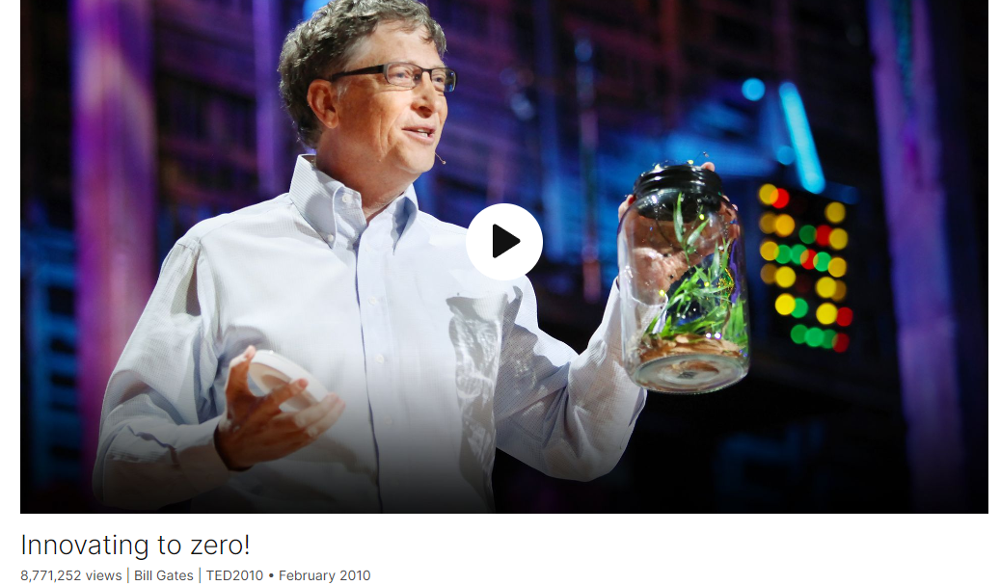
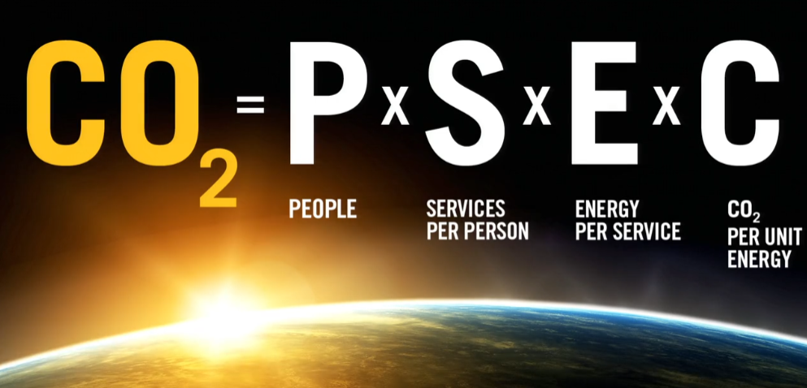
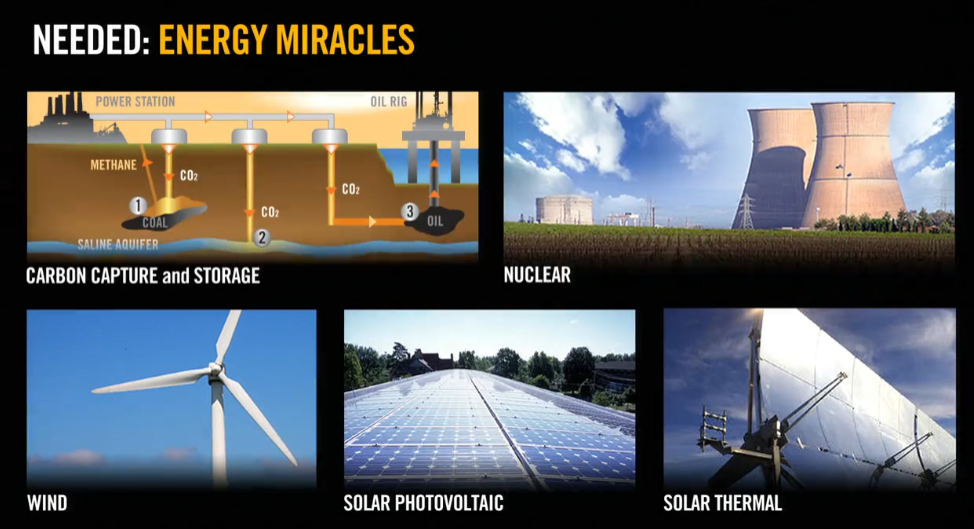
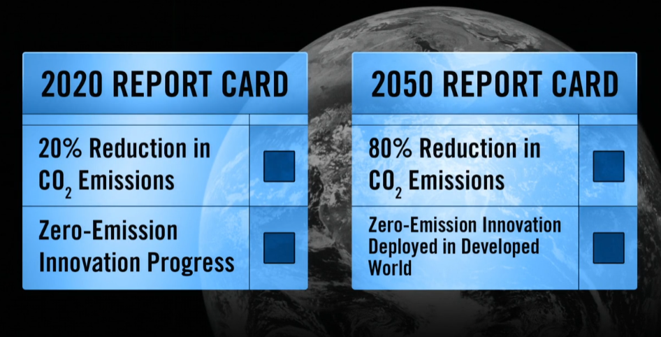
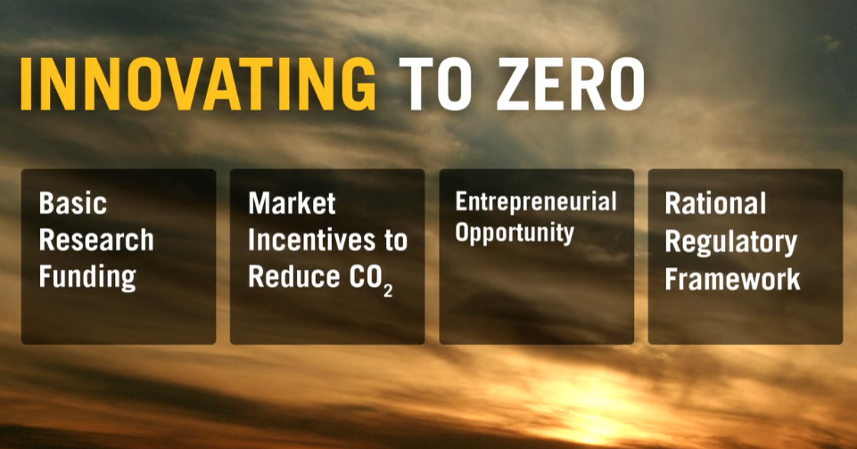

# Innovating to zero!

Link: [https://www.ted.com/talks/bill_gates_innovating_to_zero](https://www.ted.com/talks/bill_gates_innovating_to_zero)

Speaker:  Bill Gates

Date: February 2010

@[toc]

## Introduction

At TED2010, Bill Gates unveils his vision for the world's energy future, describing the need for "miracles" to avoid planetary catastrophe and explaining why he's backing a dramatically different type of nuclear reactor. The necessary goal? Zero carbon emissions globally by 2050.

## Vocabulary

dioxide: 美 [daɪˈɑːksaɪd]  二氧化物

carbon dioxide：二氧化碳

foot：英尺	

We're a twelve-foot-high truck trying to get under a ten-foot bridge, and we can just sort of squeeze under. 我们是一辆12英尺高的卡车，正试图从一座10英尺高的桥下通过，我们只能勉强挤过去。

mosquito：美 [məˈskiːtoʊ] 蚊子  mosquitoes，复数

firefly：萤火虫，fireflies，复数

gimmicky：美 ['ɡɪmɪkɪ]  耍花招的；诡计的；骗人的

tide：美 [taɪd] 潮汐，潮水，趋势

geothermal：美 [ˌdʒiːoʊˈθɜːrml] 地热的

biofuel：美 [ˈbaɪoʊˌfju(ə)l] 生物燃料

I've left out tide, geothermal, fusion, biofuels. 我忽略了潮汐、地热、核聚变和生物燃料。

intermittent：美 [ˌɪntərˈmɪtənt] 间歇的；断断续续的；不持续的；不稳定的

Also, these are intermittent sources. 此外，这些都是间歇性的来源。

uranium ：美 [jʊˈreɪniəm]  铀

stun：震惊，目瞪口呆

You'd be stunned at the ridiculously low levels of spending on these innovative approaches. 你会对这些创新方法的低得离谱的支出水平感到震惊。

pilot：美 [ˈpaɪlət] 飞行员；试验性的；试点性的；小规模的

pilot reactor：实验性反应堆

shtick：美 [ʃtɪk]  噱头；把戏；才艺

## Summary

Bill Gates delivered a speech on the critical importance of addressing energy and climate issues. He emphasized the significant impact of climate change on the world's poorest populations, highlighting how their livelihoods are directly affected by climate-related challenges such as crop failure and food insecurity. Gates underscored the essential role of energy in poverty alleviation, stating that affordable energy is fundamental to improving living standards, especially for those in impoverished regions.

Gates outlined the urgent need to address carbon dioxide (CO2) emissions, citing the necessity of reducing them to zero in order to mitigate the adverse effects of climate change. He explained the straightforward relationship between CO2 emissions and global temperature increase, emphasizing the severity of the consequences if emissions are not curtailed. Gates stressed the importance of achieving zero emissions, emphasizing the need for drastic changes in energy production and consumption practices.

In exploring potential solutions, Gates identified five key pathways, including advancements in renewable energy, nuclear power, and carbon capture and storage. He acknowledged the challenges associated with each approach, such as cost, safety concerns, and scalability. Despite the obstacles, Gates emphasized the importance of pursuing innovation and investing in research and development to drive progress in energy technology. He called for increased collaboration, research funding, and policy incentives to accelerate the transition to sustainable energy sources.

## Transcript

I'm going to talk today
about energy and climate.

And that might seem a bit surprising,

because my full-time work
at the foundation

is mostly about vaccines and seeds,

about the things that we need
to invent and deliver

to help the poorest two billion
live better lives.

But energy and climate
are extremely important to these people;

in fact, more important
than to anyone else on the planet.

The climate getting worse means
that many years, their crops won't grow:

there will be too much rain,
not enough rain;

things will change in ways their fragile
environment simply can't support.

And that leads to starvation, it leads
to uncertainty, it leads to unrest.

So, the climate changes
will be terrible for them.

Also, the price of energy
is very important to them.

In fact, if you could pick just one thing

to lower the price of to reduce poverty,
by far you would pick energy.

Now, the price of energy
has come down over time.

Really advanced civilization
is based on advances in energy.

The coal revolution fueled
the Industrial Revolution,

and, even in the 1900s,
we've seen a very rapid decline

in the price of electricity,

and that's why we have
refrigerators, air-conditioning;

we can make modern materials
and do so many things.

And so, we're in a wonderful situation
with electricity in the rich world.

But as we make it cheaper --
and let's say,

let's go for making it twice as cheap --

we need to meet a new constraint,

and that constraint has to do with CO2.

CO2 is warming the planet,

and the equation on CO2
is actually a very straightforward one.

If you sum up the CO2 that gets emitted,

that leads to a temperature increase,

and that temperature increase
leads to some very negative effects:

the effects on the weather;
perhaps worse, the indirect effects,

in that the natural ecosystems
can't adjust to these rapid changes,

and so you get ecosystem collapses.

Now, the exact amount of how you map
from a certain increase of CO2

to what temperature will be,
and where the positive feedbacks are --

there's some uncertainty there,
but not very much.

And there's certainly uncertainty
about how bad those effects will be,

but they will be extremely bad.

I asked the top scientists
on this several times:

Do we really have to get
down to near zero?

Can't we just cut it in half or a quarter?

And the answer is,
until we get near to zero,

the temperature will continue to rise.

And so that's a big challenge.

It's very different than saying,

"We're a twelve-foot-high truck
trying to get under a ten-foot bridge,

and we can just sort of squeeze under."

This is something that has to get to zero.

Now, we put out a lot
of carbon dioxide every year --

over 26 billion tons.

For each American, it's about 20 tons.

For people in poor countries,
it's less than one ton.

It's an average of about five tons
for everyone on the planet.

And somehow, we have to make changes
that will bring that down to zero.

It's been constantly going up.

It's only various economic changes
that have even flattened it at all,

so we have to go
from rapidly rising to falling,

and falling all the way to zero.

This equation has four factors,
a little bit of multiplication.

So you've got a thing on the left,
CO2, that you want to get to zero,

and that's going to be based
on the number of people,

the services each person
is using on average,

the energy, on average, for each service,

and the CO2 being put out
per unit of energy.

So let's look at each one of these,

and see how we can get this down to zero.

Probably, one of these numbers is going
to have to get pretty near to zero.

(Laughter)

That's back from high school algebra.

But let's take a look.

First, we've got population.

The world today has 6.8 billion people.

That's headed up to about nine billion.

Now, if we do a really great job
on new vaccines,

health care, reproductive health services,

we could lower that by,
perhaps, 10 or 15 percent.

But there, we see
an increase of about 1.3.

The second factor is the services we use.

This encompasses everything:

the food we eat, clothing, TV, heating.

These are very good things.

Getting rid of poverty means
providing these services

to almost everyone on the planet.

And it's a great thing
for this number to go up.

In the rich world, perhaps
the top one billion,

we probably could cut back and use less,

but every year, this number,
on average, is going to go up,

and so, overall,
that will more than double

the services delivered per person.

Here we have a very basic service:

Do you have lighting in your house
to be able to read your homework?

And, in fact, these kids don't,

so they're going out and reading
their schoolwork

under the street lamps.

Now, efficiency, "E,"
the energy for each service --

here, finally we have some good news.

We have something that's not going up.

Through various inventions
and new ways of doing lighting,

through different types of cars,
different ways of building buildings --

there are a lot of services

where you can bring the energy
for that service down

quite substantially.

Some individual services
even bring it down by 90 percent.

There are other services,
like how we make fertilizer,

or how we do air transport,

where the rooms for improvement
are far, far less.

And so overall, if we're optimistic,
we may get a reduction

of a factor of three to even,
perhaps, a factor of six.

But for these first three factors now,

we've gone from 26 billion
to, at best, maybe 13 billion tons,

and that just won't cut it.

So let's look at this fourth factor --
this is going to be a key one --

and this is the amount of CO2
put out per each unit of energy.

So the question is:
Can you actually get that to zero?

If you burn coal, no.

If you burn natural gas, no.

Almost every way
we make electricity today,

except for the emerging renewables
and nuclear, puts out CO2.

And so, what we're going to have
to do at a global scale,

is create a new system.

So we need energy miracles.

Now, when I use the term "miracle,"
I don't mean something that's impossible.

The microprocessor is a miracle.

The personal computer is a miracle.

The Internet and its services
are a miracle.

So the people here have participated
in the creation of many miracles.

Usually, we don't have a deadline

where you have to get the miracle
by a certain date.

Usually, you just kind of stand by,
and some come along, some don't.

This is a case where we actually
have to drive at full speed

and get a miracle
in a pretty tight timeline.

Now, I thought, "How could
I really capture this?

Is there some kind
of natural illustration,

some demonstration that would grab
people's imagination here?"

I thought back to a year ago
when I brought mosquitoes,

and somehow people enjoyed that.

(Laughter)

It really got them involved
in the idea of, you know,

there are people who live with mosquitoes.

With energy, all I could
come up with is this.

I decided that releasing fireflies

would be my contribution
to the environment here this year.

So here we have some natural fireflies.

I'm told they don't bite; in fact,
they might not even leave that jar.

(Laughter)

Now, there's all sorts of gimmicky
solutions like that one,

but they don't really add up to much.

We need solutions, either one or several,

that have unbelievable scale
and unbelievable reliability.

And although there's many directions
that people are seeking,

I really only see five
that can achieve the big numbers.

I've left out tide,
geothermal, fusion, biofuels.

Those may make some contribution,

and if they can do better
than I expect, so much the better.

But my key point here
is that we're going to have to work on

each of these five,

and we can't give up any of them
because they look daunting,

because they all have
significant challenges.

Let's look first at burning fossil fuels,

either burning coal
or burning natural gas.

What you need to do there seems
like it might be simple, but it's not.

And that's to take all the CO2,

after you've burned it,
going out the flue,

pressurize it, create a liquid,
put it somewhere,

and hope it stays there.

Now, we have some pilot things

that do this at the 60 to 80
percent level.

But getting up to that full percentage --
that will be very tricky.

And agreeing on where these CO2
quantities should be put will be hard,

but the toughest one here
is this long-term issue:

Who's going to be sure?

Who's going to guarantee

something that is literally
billions of times larger

than any type of waste you think of
in terms of nuclear or other things?

This is a lot of volume.

So that's a tough one.

Next would be nuclear.

It also has three big problems:

cost, particularly in highly
regulated countries, is high;

the issue of safety, really feeling good
about nothing could go wrong,

that, even though you have
these human operators,

the fuel doesn't get used for weapons.

And then what do you do with the waste?

Although it's not very large,
there are a lot of concerns about that.

People need to feel good about it.

So three very tough problems
that might be solvable,

and so, should be worked on.

The last three of the five,
I've grouped together.

These are what people often refer to
as the renewable sources.

And they actually -- although it's great
they don't require fuel --

they have some disadvantages.

One is that the density of energy
gathered in these technologies

is dramatically less than a power plant.

This is energy farming,

so you're talking about many square miles,
thousands of times more area

than you think of
as a normal energy plant.

Also, these are intermittent sources.

The sun doesn't shine all day,
it doesn't shine every day,

and likewise, the wind
doesn't blow all the time.

And so, if you depend on these sources,

you have to have some way
of getting the energy

during those time periods
that it's not available.

So we've got big cost challenges here.

We have transmission challenges;

for example, say this energy source
is outside your country,

you not only need the technology,

but you have to deal with the risk
of the energy coming from elsewhere.

And, finally, this storage problem.

To dimensionalize this,

I went through and looked
at all the types of batteries made --

for cars, for computers, for phones,
for flashlights, for everything --

and compared that to the amount
of electrical energy the world uses.

What I found is that all
the batteries we make now

could store less than 10 minutes
of all the energy.

And so, in fact, we need
a big breakthrough here,

something that's going to be
a factor of 100 better

than the approaches we have now.

It's not impossible,
but it's not a very easy thing.

Now, this shows up when you try
to get the intermittent source

to be above, say, 20 to 30 percent
of what you're using.

If you're counting on it for 100 percent,

you need an incredible miracle battery.

Now, how are we going to go forward
on this -- what's the right approach?

Is it a Manhattan Project?
What's the thing that can get us there?

Well, we need lots of companies
working on this -- hundreds.

In each of these five paths,
we need at least a hundred people.

A lot of them, you'll look at
and say, "They're crazy."

That's good.

And, I think, here in the TED group,

we have many people
who are already pursuing this.

Bill Gross has several companies,
including one called eSolar

that has some great
solar thermal technologies.

Vinod Khosla is investing
in dozens of companies

that are doing great things
and have interesting possibilities,

and I'm trying to help back that.

Nathan Myhrvold and I
actually are backing a company

that, perhaps surprisingly,
is actually taking the nuclear approach.

There are some innovations
in nuclear: modular, liquid.

Innovation really stopped
in this industry quite some ago,

so the idea that there's some
good ideas laying around

is not all that surprising.

The idea of TerraPower is that,
instead of burning a part of uranium --

the one percent, which is the U235 --

we decided, "Let's burn
the 99 percent, the U238."

It is kind of a crazy idea.

In fact, people had talked
about it for a long time,

but they could never simulate properly
whether it would work or not,

and so it's through the advent
of modern supercomputers

that now you can simulate
and see that, yes,

with the right materials approach,
this looks like it would work.

And because you're burning
that 99 percent,

you have greatly improved cost profile.

You actually burn up the waste,
and you can actually use as fuel

all the leftover waste
from today's reactors.

So instead of worrying about them,
you just take that, it's a great thing.

It breeds this uranium as it goes along,
so it's kind of like a candle.

You see it's a log there, often
referred to as a traveling wave reactor.

In terms of fuel,
this really solves the problem.

I've got a picture here
of a place in Kentucky.

This is the leftover, the 99 percent,

where they've taken out
the part they burn now,

so it's called depleted uranium.

That would power the US
for hundreds of years.

And simply by filtering seawater
in an inexpensive process,

you'd have enough fuel for the entire
lifetime of the rest of the planet.

So, you know, it's got lots
of challenges ahead,

but it is an example of the many
hundreds and hundreds of ideas

that we need to move forward.

So let's think: How should
we measure ourselves?

What should our report card look like?

Well, let's go out to where
we really need to get,

and then look at the intermediate.

For 2050, you've heard many people
talk about this 80 percent reduction.

That really is very important,
that we get there.

And that 20 percent will be used up
by things going on in poor countries --

still some agriculture; hopefully,
we will have cleaned up forestry, cement.

So, to get to that 80 percent,

the developed countries,
including countries like China,

will have had to switch
their electricity generation altogether.

The other grade is: Are we deploying
this zero-emission technology,

have we deployed it
in all the developed countries

and are in the process
of getting it elsewhere?

That's super important.

That's a key element
of making that report card.

Backing up from there, what should
the 2020 report card look like?

Well, again, it should have
the two elements.

We should go through these efficiency
measures to start getting reductions:

The less we emit,
the less that sum will be of CO2,

and therefore, the less the temperature.

But in some ways, the grade we get there,

doing things that don't get us
all the way to the big reductions,

is only equally, or maybe even slightly
less, important than the other,

which is the piece of innovation
on these breakthroughs.

These breakthroughs,
we need to move those at full speed,

and we can measure that
in terms of companies,

pilot projects, regulatory things
that have been changed.

There's a lot of great books
that have been written about this.

The Al Gore book, "Our Choice,"

and the David MacKay book,
"Sustainable Energy Without the Hot Air."

They really go through it
and create a framework

that this can be discussed broadly,

because we need broad backing for this.

There's a lot that has to come together.

So this is a wish.

It's a very concrete wish
that we invent this technology.

If you gave me only one wish
for the next 50 years --

I could pick who's president,

I could pick a vaccine,
which is something I love,

or I could pick that this thing

that's half the cost with no CO2
gets invented --

this is the wish I would pick.

This is the one with the greatest impact.

If we don't get this wish,

the division between the people
who think short term and long term

will be terrible,

between the US and China,
between poor countries and rich,

and most of all,

the lives of those two billion
will be far worse.

So what do we have to do?

What am I appealing to you
to step forward and drive?

We need to go for more research funding.

When countries get together
in places like Copenhagen,

they shouldn't just discuss the CO2.

They should discuss
this innovation agenda.

You'd be stunned at the ridiculously
low levels of spending

on these innovative approaches.

We do need the market incentives --
CO2 tax, cap and trade --

something that gets
that price signal out there.

We need to get the message out.

We need to have this dialogue
be a more rational,

more understandable dialogue,

including the steps
that the government takes.

This is an important wish,
but it is one I think we can achieve.

Thank you.

(Applause)

##  Q&A with Chris Anderson

Chris Anderson: Thank you. Thank you.

(Applause)

CA: Thank you.

So to understand more about TerraPower.

I mean, first of all, can you give a sense
of what scale of investment this is?

Bill Gates: To actually do the software,
buy the supercomputer,

hire all the great scientists,
which we've done,

that's only tens of millions.

And even once we test our materials out
in a Russian reactor

to make sure our materials work properly,

then you'll only be up
in the hundreds of millions.

The tough thing
is building the pilot reactor --

finding the several billion,
finding the regulator, the location

that will actually build
the first one of these.

Once you get the first one built,
if it works as advertised,

then it's just clear as day,

because the economics,
the energy density, are so different

than nuclear as we know it.

CA: So to understand it right,

this involves building
deep into the ground,

almost like a vertical column
of nuclear fuel, of this spent uranium,

and then the process starts
at the top and kind of works down?

BG: That's right.

Today, you're always
refueling the reactor,

so you have lots of people and lots
of controls that can go wrong,

where you're opening it up
and moving things in and out --

that's not good.

So if you have very --

(Laughter)

very cheap fuel
that you can put 60 years in --

just think of it as a log --

put it down and not have
those same complexities.

And it just sits there and burns
for the 60 years, and then it's done.

CA: It's a nuclear power plant
that is its own waste disposal solution.

BG: Yeah; what happens with the waste,

you can let it sit there -- there's a lot
less waste under this approach --

then you can actually take that

and put it into another one and burn that.

And we start out, actually,
by taking the waste that exists today

that's sitting in these cooling pools
or dry-casking by reactors --

that's our fuel to begin with.

So the thing that's been a problem
from those reactors

is actually what gets fed into ours,

and you're reducing the volume
of the waste quite dramatically

as you're going through this process.

CA: You're talking
to different people around the world

about the possibilities.

Where is there most interest
in actually doing something with this?

BG: Well, we haven't picked
a particular place,

and there's all these interesting
disclosure rules

about anything that's called "nuclear."

So we've got a lot of interest.

People from the company
have been in Russia, India, China.

I've been back seeing
the secretary of energy here,

talking about how this fits
into the energy agenda.

So I'm optimistic.

The French and Japanese
have done some work.

This is a variant on something
that has been done.

It's an important advance,
but it's like a fast reactor,

and a lot of countries have built them,

so anybody who's done
a fast reactor is a candidate

to be where the first one gets built.

CA: So, in your mind,

timescale and likelihood of actually
taking something like this live?

BG: Well, we need -- for one of these
high-scale, electro-generation things

that's very cheap,

we have 20 years to invent
and then 20 years to deploy.

That's sort of the deadline

that the environmental models
have shown us that we have to meet.

And TerraPower -- if things go well,
which is wishing for a lot --

could easily meet that.

And there are, fortunately
now, dozens of companies --

we need it to be hundreds --

who, likewise, if their science goes well,

if the funding for their pilot
plants goes well,

that they can compete for this.

And it's best if multiple succeed,

because then you could use
a mix of these things.

We certainly need one to succeed.

CA: In terms of big-scale
possible game changers,

is this the biggest
that you're aware of out there?

BG: An energy breakthrough
is the most important thing.

It would have been, even
without the environmental constraint,

but the environmental constraint
just makes it so much greater.

In the nuclear space,
there are other innovators.

You know, we don't know their work
as well as we know this one,

but the modular people,
that's a different approach.

There's a liquid-type reactor,
which seems a little hard,

but maybe they say that about us.

And so, there are different ones,

but the beauty of this
is a molecule of uranium

has a million times as much energy
as a molecule of, say, coal.

And so, if you can
deal with the negatives,

which are essentially the radiation,
the footprint and cost,

the potential, in terms of effect
on land and various things,

is almost in a class of its own.

CA: If this doesn't work, then what?

Do we have to start taking
emergency measures

to try and keep the temperature
of the earth stable?

BG: If you get into that situation,

it's like if you've been overeating,
and you're about to have a heart attack.

Then where do you go?

You may need heart surgery or something.

There is a line of research
on what's called geoengineering,

which are various techniques
that would delay the heating

to buy us 20 or 30 years
to get our act together.

Now, that's just an insurance policy;
you hope you don't need to do that.

Some people say you shouldn't even
work on the insurance policy

because it might make you lazy,

that you'll keep eating because you know
heart surgery will be there to save you.

I'm not sure that's wise,
given the importance of the problem,

but there's now
the geoengineering discussion

about: Should that be in the back
pocket in case things happen faster,

or this innovation goes
a lot slower than we expect?

CA: Climate skeptics:

If you had a sentence or two
to say to them,

how might you persuade them
that they're wrong?

BG: Well, unfortunately,
the skeptics come in different camps.

The ones who make scientific
arguments are very few.

Are they saying there's negative
feedback effects

that have to do with clouds
that offset things?

There are very, very few things
that they can even say

there's a chance
in a million of those things.

The main problem we have here --
it's kind of like with AIDS:

you make the mistake now,
and you pay for it a lot later.

And so, when you have
all sorts of urgent problems,

the idea of taking pain now
that has to do with a gain later,

and a somewhat uncertain pain thing.

In fact, the IPCC report --
that's not necessarily the worst case,

and there are people in the rich world
who look at IPCC and say,

"OK, that isn't that big of a deal."

The fact is it's that uncertain part
that should move us towards this.

But my dream here is that,

if you can make it economic,
and meet the CO2 constraints,

then the skeptics say,

"OK, I don't care
that it doesn't put out CO2,

I kind of wish it did put out CO2.

But I guess I'll accept it,

because it's cheaper
than what's come before."

(Applause)

CA: So that would be your response
to the Bjørn Lomborg argument,

basically if you spend all this energy
trying to solve the CO2 problem,

it's going to take away
all your other goals

of trying to rid the world
of poverty and malaria and so forth,

it's a stupid waste
of the Earth's resources

to put money towards that

when there are better things we can do.

BG: Well, the actual
spending on the R&D piece --

say the US should spend 10 billion a year
more than it is right now --

it's not that dramatic.

It shouldn't take away from other things.

The thing you get into big money on,
and reasonable people can disagree,

is when you have something
that's non-economic

and you're trying to fund that --

that, to me, mostly is a waste.

Unless you're very close,

and you're just funding the learning curve
and it's going to get very cheap,

I believe we should try more things

that have a potential
to be far less expensive.

If the trade-off you get into is,
"Let's make energy super expensive,"

then the rich can afford that.

I mean, all of us here could pay
five times as much for our energy

and not change our lifestyle.

The disaster is for that two billion.

And even Lomborg has changed.

His shtick now is, "Why isn't the R&D
getting more discussed?"

He's still, because of his earlier stuff,

still associated with the skeptic camp,

but he's realized
that's a pretty lonely camp,

and so, he's making the R&D point.

And so there is a thread of something
that I think is appropriate.

The R&D piece --
it's crazy how little it's funded.

CA: Well, Bill, I suspect I speak
on behalf of most people here

to say I really hope your wish comes true.

Thank you so much.

BG: Thank you.

(Applause)

## Afterword

2024年4月30日22点23分完成这篇演讲的学习。

