# Ilya Sutskever: "Sequence to sequence learning with neural networks: what a decade"

Link: [https://www.youtube.com/watch?v=1yvBqasHLZs](https://www.youtube.com/watch?v=1yvBqasHLZs)

>Ilya Sutskever full talk "Sequence to sequence learning with neural networks: what a decade" at NeurIPS 2024 in Vancouver, Canada. 
>
>"Pre-training as we know it will end" and what comes next is superintelligence: agentic, reasons, understands and is self aware. 
>
>NeurIPS 2024 — 2024 Conference on Neural Information Processing Systems.

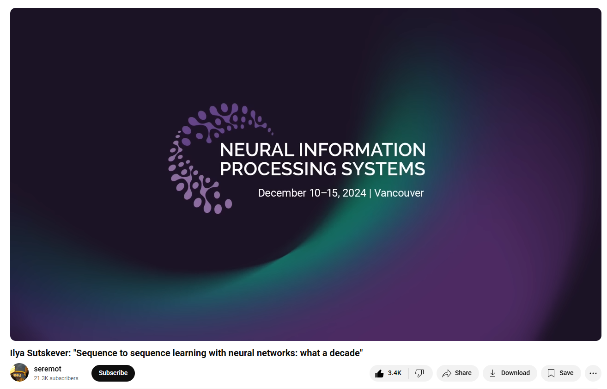

## Summary

### [ @nowithinkyouknowyourewrong8675](https://www.youtube.com/@nowithinkyouknowyourewrong8675) summary

[2 days ago](https://www.youtube.com/watch?v=1yvBqasHLZs&lc=UgzXzpb6-xtqarqsnjF4AaABAg)

Here are Ilya Sutskever's main points and conclusions in brief: 

Main Points: 

*Original Success Formula (2014)*  

- Large neural network  
-   Large dataset    
- Autoregressive model   
- This simple combination proved surprisingly effective 

*Evolution of Pre-training*   

- Led to breakthrough models like GPT-2, GPT-3   
- Drove major AI progress over the decade   
- However, pre-training era will eventually end due to data limitations 

*Data Limitation Crisis*   

- We only have "one internet" worth of data   
- Data is becoming AI's "fossil fuel"   
- This forces the field to find new approaches 

Key Conclusions: 

*Future Directions*   

- Need to move beyond pure pre-training   
- Potential solutions include:     
  - Agent-based approaches     
  - Synthetic data     
  - Better inference-time compute 

*Path to Superintelligence*   

- Current systems will evolve to be:    
  - Truly agentic (versus current limited agency)     
  - Capable of real reasoning     
  - More unpredictable     
  - Self-aware   
- This transition will create fundamentally different AI systems from what we have today 

*Historical Perspective*   

- The field has made incredible progress in 10 years   
- Many original insights were correct, but some approaches (like pipelining) proved suboptimal   
- We're still in early stages of what's possible with AI 

The overarching message is that while the original approach was revolutionary and led to tremendous progress, the field must evolve beyond current methods to achieve next-level AI capabilities.

### [@labsanta](https://www.youtube.com/@labsanta) summary

[1 day ago](https://www.youtube.com/watch?v=1yvBqasHLZs&lc=UgyP2v-t6cROHohxWW94AaABAg)

[00:07](https://www.youtube.com/watch?v=1yvBqasHLZs&t=7s) - Reflecting on a decade of advancements in neural network learning. 

[02:52](https://www.youtube.com/watch?v=1yvBqasHLZs&t=172s) - Neural networks can mimic human cognitive functions for tasks like translation. 

[05:05](https://www.youtube.com/watch?v=1yvBqasHLZs&t=305s) - Early parallelization techniques led to significant advancements in neural network training. 

[07:45](https://www.youtube.com/watch?v=1yvBqasHLZs&t=465s) - Pre-training in AI is reaching its limits due to finite data availability. 

[10:27](https://www.youtube.com/watch?v=1yvBqasHLZs&t=627s) - Examining brain and body size relationships in evolution. 

[12:55](https://www.youtube.com/watch?v=1yvBqasHLZs&t=775s) - Evolution from basic AI to potential superintelligent systems. 

[15:14](https://www.youtube.com/watch?v=1yvBqasHLZs&t=914s) - Future AI will possess unpredictable capabilities and self-awareness, transforming their functionalities.

 [17:46](https://www.youtube.com/watch?v=1yvBqasHLZs&t=1066s) - Biologically inspired AI has limited biological inspiration but holds potential for future insights. 

[19:43](https://www.youtube.com/watch?v=1yvBqasHLZs&t=1183s) - Exploring the implications of AI and rights for future intelligent beings. 

[22:06](https://www.youtube.com/watch?v=1yvBqasHLZs&t=1326s) - Out-of-distribution generalization in LLMs is complex and not easily defined. 

[24:22](https://www.youtube.com/watch?v=1yvBqasHLZs&t=1462s) - Ilya Sutskever concludes with gratitude and audience engagement.

### By GPT4o

The speaker in the transcript reflects on a decade of progress in AI, particularly in the field of neural networks and large language models. The core idea of their speech is a retrospective on the work they did ten years ago, revisiting some hypotheses and highlighting how the field has evolved. Here's a breakdown of some key themes discussed:

1. **Auto-Regressive Models and Large Neural Networks**

- **Past Vision**: The speaker emphasized a deep learning "dogma" that if human brains can perform tasks quickly, then a sufficiently large neural network could replicate those tasks. They argued that a 10-layer neural network could potentially do anything a human could do in a fraction of a second.
- **Translation Task**: The humble goal back then was machine translation. The speaker highlighted how training an auto-regressive model on large datasets could capture the correct distribution for tasks like translation.
- **Evolution of Ideas**: The core idea that large neural networks could mimic human capabilities, while still somewhat true, has evolved as our understanding of AI's limitations has deepened.

2. **Scaling Laws and Pre-training**

- The speaker discusses how, as the field progressed, scaling laws became central to understanding model performance. The scaling hypothesis—train larger models on larger datasets—has proven to be quite successful, leading to breakthroughs in pre-training techniques, such as GPT-2 and GPT-3.
- However, the speaker acknowledges that **pre-training** as a paradigm is nearing its limit. There’s a growing sense that **data**, the "fuel" for AI models, is not growing indefinitely due to physical and logistical constraints (e.g., only one "internet" exists to generate data).

3. **The End of Pre-Training**

- The speaker predicts that the era of massive pre-training will eventually end due to diminishing returns on data. While hardware and computational power continue to improve, the availability of new data is finite.
- **What comes next?**: The speaker speculates that new techniques—like agents, synthetic data, and inference-time compute—might provide alternatives to current pre-training approaches.

4. **Superintelligence and AI Reasoning**

- The future of AI, according to the speaker, is inevitably moving toward **superintelligence**. This will manifest in AI systems that are **agentic** (capable of autonomous reasoning and decision-making) and **unpredictable**, especially in tasks that require deep reasoning or limited data.
- AI reasoning will involve making decisions based on partial or imprecise information, which could lead to much more unpredictable behavior compared to today's AI systems.

5. **Human-AI Relationships**

- A thought-provoking question arises about the **relationship between humans and future AI systems**. The possibility of AI becoming **self-aware** or having its own "rights" is discussed.
- The speaker suggests that this could lead to a future where AI systems coexist with humans, possibly with rights, though they caution that creating an appropriate incentive structure for this coexistence would be challenging and complex.

6. **Biological Inspiration in AI**

- The speaker briefly addresses the desire for more biologically inspired AI, specifically beyond just using neurons as a model for artificial neurons. While this has had some success, deeper biological inspiration has been hard to achieve. The speaker encourages those with fresh insights into the biological underpinnings of cognition to pursue them.

7. **Hallucinations and AI Correction**

- A question about **hallucinations** (AI-generated content that is not based on reality) is raised. The speaker agrees that, with **reasoning models**, AI might be able to "correct" its own hallucinations in the future, improving the reliability of these systems.
- This hints at a future where AI is not just mimicking human intuition but actually reasoning through problems, which could result in better error detection and self-correction.

------

Overall Themes and Speculations:

- **Evolution of AI**: The progress made over the past decade has been astounding, but there's still a long way to go.
- **Challenges of Superintelligence**: When AI evolves to a level beyond human intelligence, it will introduce new, unpredictable challenges.
- **The Limitations of Pre-Training**: As data becomes a limiting factor, AI researchers will need to innovate beyond the current methods of massive pre-training.
- **Future of Human-AI Relations**: As AI becomes more capable, questions of autonomy, rights, and coexistence with humans will need to be addressed.

​	

## Transcript

### Retrospect Talk of 2014 NeurIPS

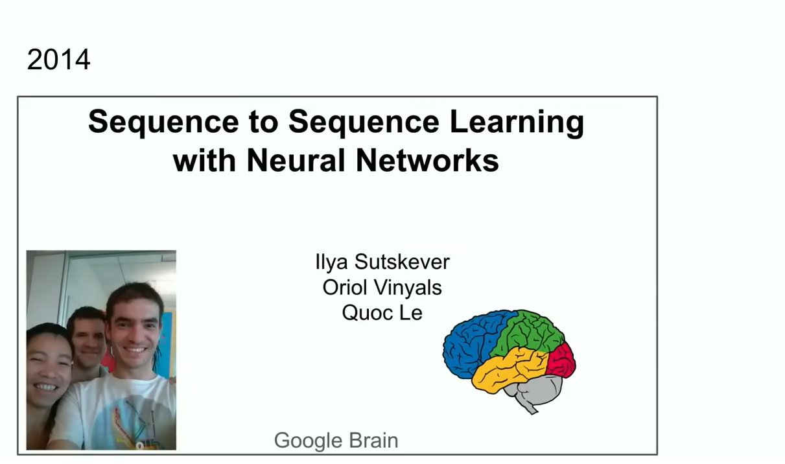

I want to thank the organizers for choosing a paper for this award it was very nice 

and I also want to thank my incredible co-authors and collaborators

Oriol Vinyals and Quoc Le who stood right before you a moment ago and 

what you have here is an image a screenshot from a similar talk 10 years ago at new NeurIPS in 2014 in Montreal and 

it was a much more innocent time here we are shown in the photos this is the before here's the after by the way 

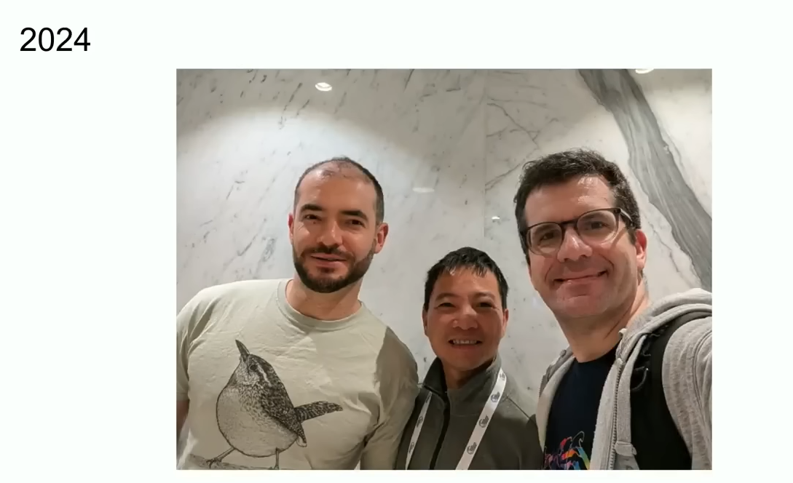

and now we've got more experienced hopefully wiser but here I'd like to talk a little bit about the work itself and maybe a 10year retrospective on it 

because a lot of the things in this work were correct but some not so much

and we can review them and we can see what happened and how it gently flowed to where we are today 

so let's begin by talking about what we did and the way we'll do it is by showing slides from the same talk 10 years ago 

but the summary of what we did is the following three bullet points it's an auto regressive model train on text it's a large neural network and it's a large data set and that's it 

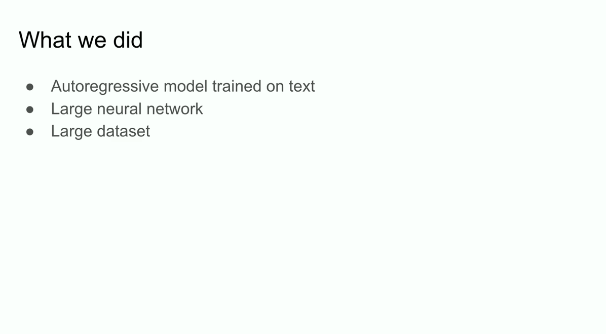

now let's dive in into the details a little bit more so this was a slide 10 years ago not too bad 

the **Deep learning hypothesis** and what we said here is that

if you have a large neural network with 10 layers then it can do anything that a human being can do in a fraction of a

second 

like why did we have this emphasis on things that human beings can do in a fraction of a second

why this thing specifically 

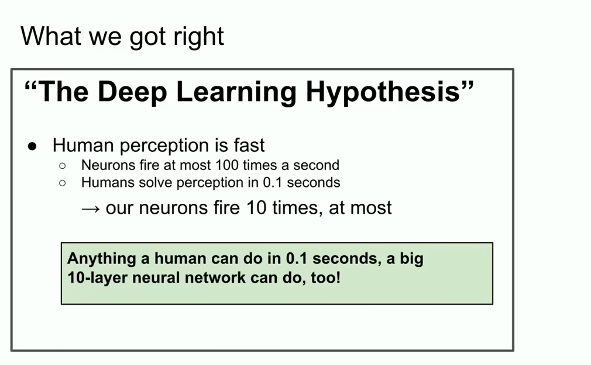

well if you believe the Deep learning Dogma so to say that artificial neurons and biological neurons are similar or at

least not too different 

and you believe that real neurons are slow than anything that we can do quickly by we I mean human beings I even mean just one human in the entire

world if there is one human in the entire world that can do some task in a fraction of a second then a 10 layer neural network can do it too  right 

it follows you just take their connections and you embed them inside your neuronet the artificial one so this was the motivation 

anything that a human being can do in a fraction of a second  a big 10 layer neural network can do too 

we focused on 10 layer neural networks because this was the neural networks we knew how to train back in the day 

if you could go beyond in your layers somehow then you could do more

but back then we could only do 10 layers which is why we emphasized whatever human beings can do in a fraction of a second 

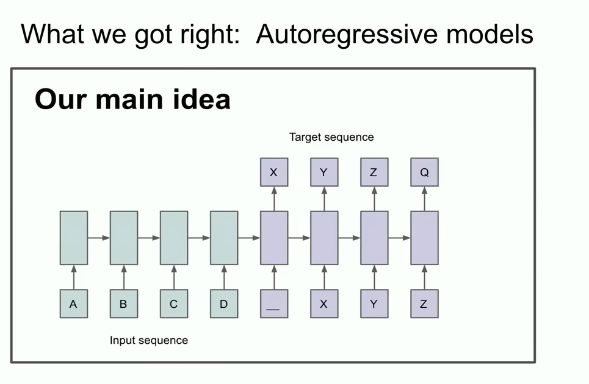

a different slide from the talk a slide which says our main idea and you may be able to recognize two things or at least one thing 

you might be able to recognize that something Auto regressive is going on here 

what is it saying really what does this slide really say this slide says that 

if you have an autoregressive model and it predicts the next token well enough then it will in fact grab and capture and grasp the correct

distribution over whatever sequences that come next and this was a relatively new thing 

it wasn't literally the first ever Auto regressive neural network  but I would argue it was the first Autoregressive neural network where we

really believed that if you train it really well then you will get whatever you want  in our case back then was the humble today humble then incredibly audacious task of translation 

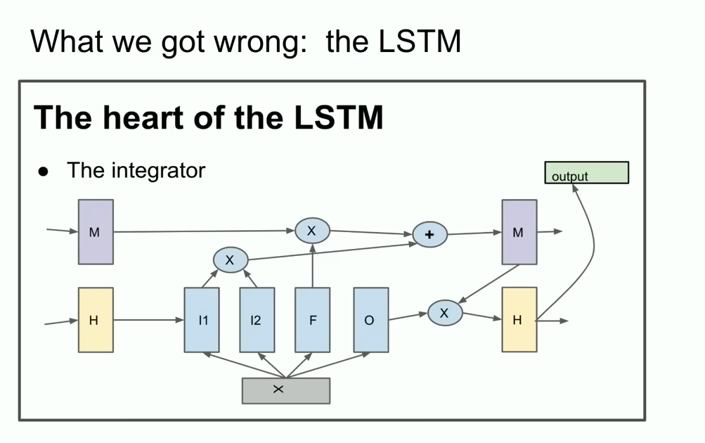

now I'm going to show you some ancient history that many of you might have never seen before it's called the lstm to those unfamiliar an lstm is the

things that poor deep learning researchers did before Transformers and **it's basically a resnet but rotated 90°** 

so that's an lstm and it came before it's like kind of a slightly more complicated reset you can see there is your integrator which is now called the residual stream but you've got some multiplication going on it's a little bit more complicated but that's what we did it was a reset Rotated 90° 

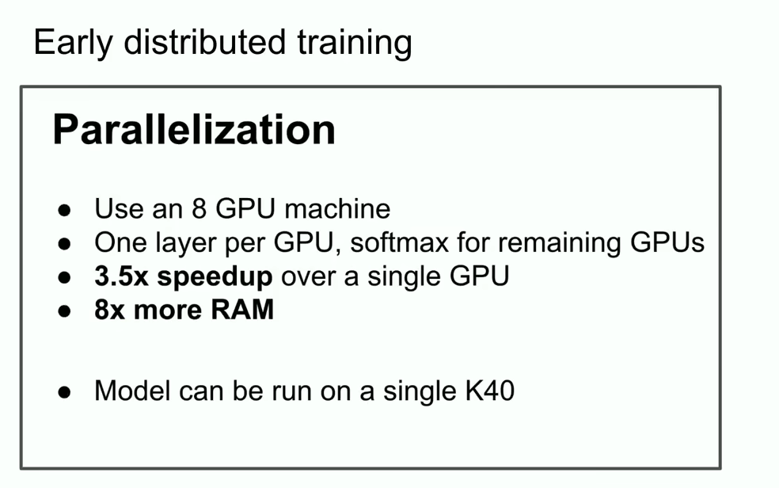

another cool feature from that Old talk that I want to highlight is that we used parallelization but not just any parallelization we used 

pipelining as witnessed by this one layer per GPU 

was it wise to pipeline as we now know?  

pipelining is not wise  but we were not as wise back then so we used that and we got a 3.5x speed up using eight gpus

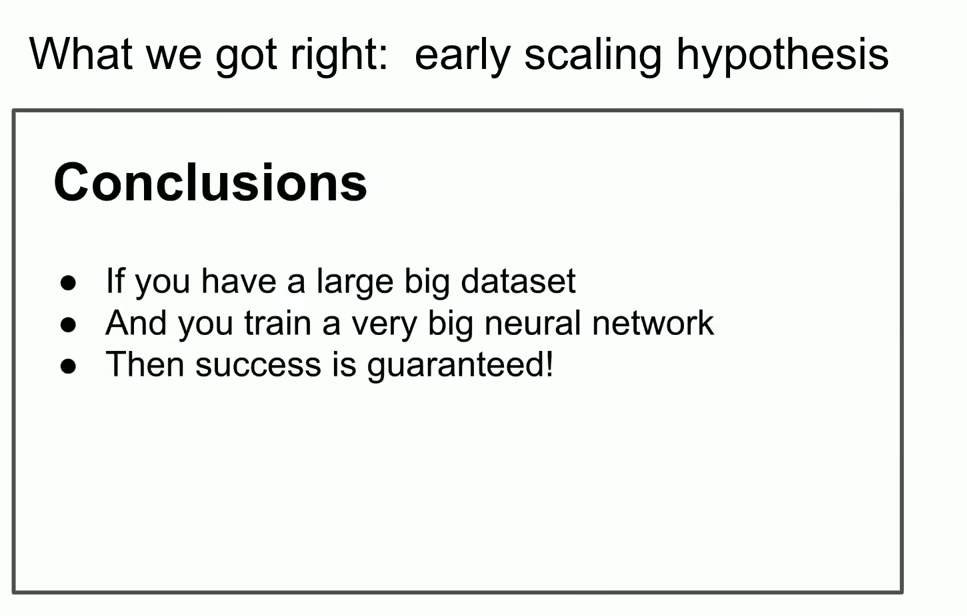

### Core idea

and the conclusion slide in some sense the conclusion slide from the talk from back then is the most important slide

because it spelled out what could arguably be **the beginning of the scaling hypothesis** right 

that if you have a very big data set and you train a very big neural network then success is guaranteed 

and one can argue if one is charitable that this indeed has been what's been happening

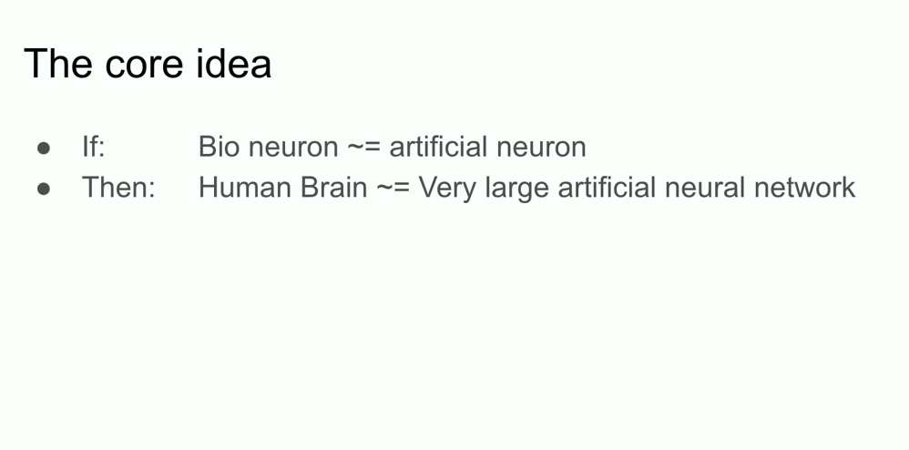

### The age of Pre-training 

I want to mention one other idea and this is I claim the idea that truly stood the test of time it's the core idea of deep learning itself it's the idea

of connectionism 

it's the idea that if you allow yourself to believe that an artificial neuron is kind of sort of like a biological neuron right ?

if you believe that one is kind of sort like the other then it gives you the confidence to believe that very large neural networks they don't need to be literally human brain scale they might be a little bit smaller 

but you could configure them to do pretty much all the things that we do human beings 

there is still a difference because the human brain also figures out how to reconfigure itself whereas we are using the best learning algorithms that we

have which require as many data points as there are parameters 

human beings are still better in this regard 

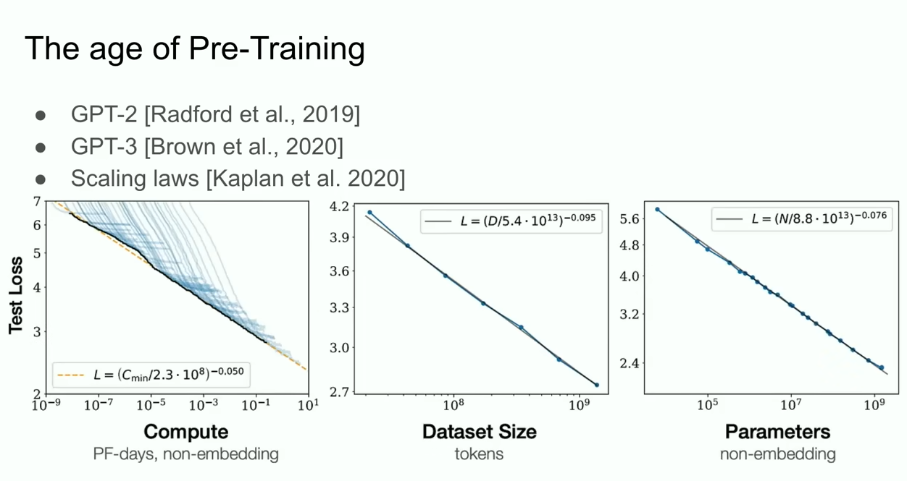

but what this led so I claim arguably to the age of pre-training and the age of pre-training is what we might say the gpt2 model the gpt3 model the

scaling laws  and I want to specifically call out my former collaborators Alec Radford [https://scholar.google.com/citations?user=dOad5HoAAAAJ&hl=en](https://scholar.google.com/citations?user=dOad5HoAAAAJ&hl=en) also Jared Kaplan [https://www.linkedin.com/in/jared-kaplan-645843213/](https://www.linkedin.com/in/jared-kaplan-645843213/), Dario Amodei [https://en.wikipedia.org/wiki/Dario_Amodei](https://en.wikipedia.org/wiki/Dario_Amodei) for really making this work but that led to the age of pre-training 

### Pre-training will  end

and this is what's been the driver of all the progress that we see today extra large neural networks extraordinary large neural networks trained on huge datasets but pre-training as we know it will unquestionably end

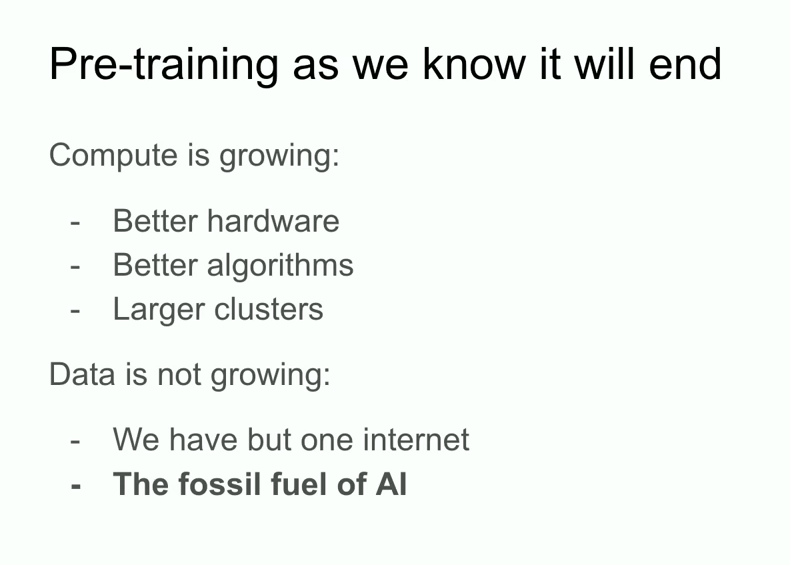

pre-training will end why will it end because while computers growing through better Hardware better algorithms and larger clusters right all those things keep increasing your compute all these things keep increasing your compute 

the data is not growing because we have but one internet we have but one internet you could even say you can even go as far as to say that **data is the**

**fossil fuel of AI**  it was like created somehow and now we use it and we've achieved Peak data and there'll be no more we have to deal with the data that we have now it still still let us go quite far but this is there's only one internet 

### What comes next?

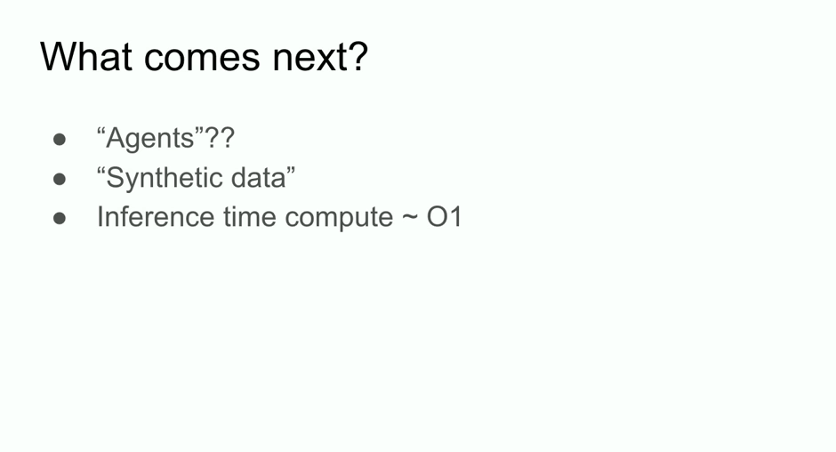

so here I'll take a bit of Liberty to speculate about what comes next actually I don't need to speculate because many people are speculating too

and I'll mention their speculations 

you may have heard the phrase agents it's common and I'm sure that eventually something will happen but people feel like something agents is

the future 

more concretely but also a little bit vaguely synthetic data but what does synthetic data mean figuring this out is a big challenge

and I'm sure that different people have all kinds of interesting progress there

and an inference time compute or maybe what's been most recently most vividly seen in 01 the o1 model these are all examples of things of people trying to figure out what to do after pre-training and those are all very good things to do 

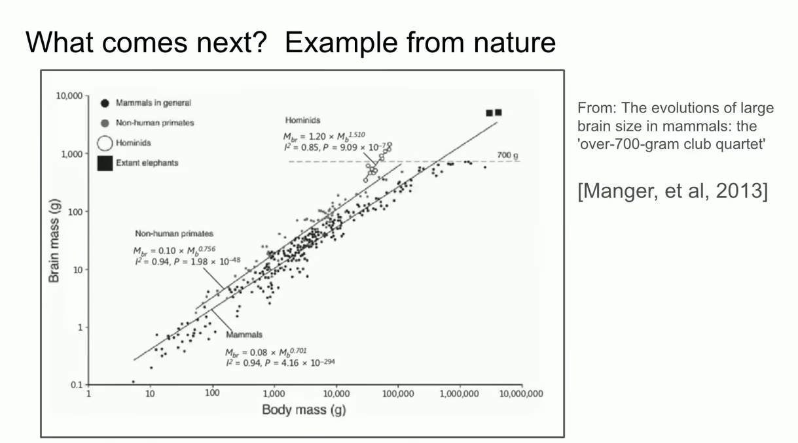

I want to mention one other example from biology which I think is really cool

and the example is this so about many many years ago at this conference also I saw a talk where someone presented this graph but the graph showed the relationship between the size of the body of the size of the body of a mammal and the size of their brain in this case it's in mass 

and the that talk I remember vividly they were saying look it's in biology everything is so messy but here you have one rare example where

there is a very tight relationship between the size of the body of the animal and their brain and 

totally randomly I became curious at this graph and one of the early one of the early so I went to Google to do research to to look for this graph and one of the images and Google Images was this and the interesting thing in this image is you see like 

I don't know is the mouse work working oh yeah the mouse is working great 

so you've got this mammals right all the different mammals then you've got nonhuman primates(灵长类动物) it's basically the same thing but then you've got the hominids(类人猿；人类；) and to my knowledge hominids are like close relatives to the humans in evolution like the Neanderthals there's a bunch of them like it's called **Homo habilis** maybe there a whole bunch 

>GPT4o的知识：
>
>从上下文来看，很可能是指 **Neanderthals**（尼安德特人），它们是人类的近亲，在进化上与现代人类有着密切的关系。尼安德特人属于 **Hominidae**（类人猿科），这个群体包括人类、尼安德特人和其他早期人类种群。
>
>至于 **Homo habilis**（能人），它是 **Homo**（人属）中的一种早期成员，生活在大约240万至180万年前。被认为是最早的工具使用者之一，标志着人类从更原始的猿类向现代人类过渡的一个重要阶段。
>
>词汇说明：
>
>- **Neanderthals** (尼安德特人): 属于类人猿科的一种人类近亲，生活在约40万至3万年前，已灭绝。其基因与现代人类有一定的重叠。
>  - Example: "The Neanderthals were our close relatives, living in Europe and parts of Asia." 尼安德特人是我们近亲，生活在欧洲和部分亚洲。
>- **Homo habilis** (能人): 一种早期人类，生活在大约240万到180万年前，被认为是第一个使用工具的类人。
>  - Example: "Homo habilis is one of the earliest species in the genus Homo, known for using stone tools." 能人是人属中最早的物种之一，因使用石器工具而闻名。

and they're all here and what's interesting is that they have a different slope on their brain to body scaling exponent so that's pretty cool what that means is that there is a precedent there is an example of biology figuring out some kind of different scaling something clearly is different so I think that is cool and by the way I want to highlight this x-axis is log scale you see this is 100 this is a th000 10,000 100,000 and likewise in grams 1 g 10 G 100 g 1000g 

so it is possible for things to be different the things that we are doing the things that we've been scaling so far is actually the first thing that we

figured out how to scale and without doubt the field everyone who's working here will figure out what to do 

### What comes next? The long term

but I want to talk here I want to take a few minutes and speculate about the longer term the longer term where are we all headed right we're

making all this progress it's an it's astounding progress It's really I mean those of you who' have been in the field 10 years ago and you remember just

how incapable everything has been like yes you can say even if you kind of say of course deep learning still to see it is just unbelievable it's completely I can't convey that feeling to you 

you know if you joined the field in the last two years then of course you speak to computers and they talk back to you and they disagree and that's what

computers are but it hasn't always been the case 

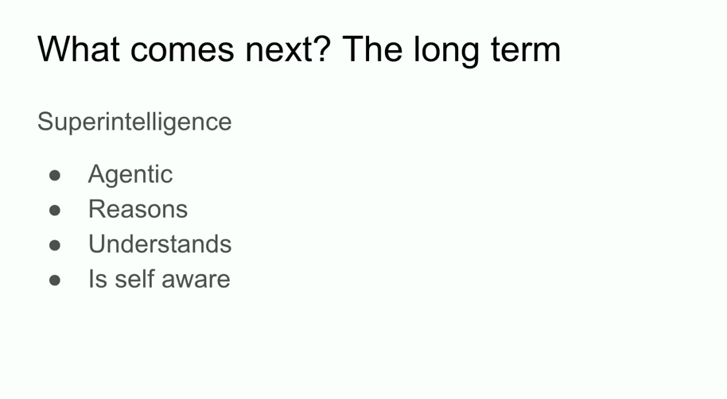

but I want to talk to a little bit about super intelligence just a bit because that is obviously where this field is headed this is obviously what's being

built here and the thing about super intelligence is that it will be different qualitatively from what we have and my goal in the next minute to try to give

you some concrete intuition of how it will be different so that you yourself could reason about it 

so right now we have our incredible language models and the unbelievable chat bot and they can even do things but they're also kind of strangely

unreliable and they get confused when while also having dramatically superhuman performance on evals so it's really unclear how to reconcile this 

but eventually sooner or later the following will be achieved those systems are actually going to be agentic in a real ways whereas right now the systems are not agents in any meaningful sense just very that might be too strong they're very very slightly agentic just beginning 

it will actually reason and by the way I want to mention something about reasoning is that a system that reasons the more it reasons the more

unpredictable it becomes the more it reasons the more unpredictable it becomes all the Deep learning that we've been used to is very predictable because if you've been working on replicating human intuition essentially it's like the gut fi (机翻错误"gut fi" 很可能是指 **"gut feeling"**（直觉）)if you come back to the 0.1 second reaction time what kind of

processing we do in our brains 

>在这个场景中，"gut fi" 很可能是指 **"gut feeling"**（直觉）。"Gut feeling" 是指我们在没有明确的理性分析或证据支持的情况下，凭借直觉做出的判断或反应，通常是一种本能的反应，类似于人们对某些情况的第一感觉。
>
>这里的意思是在讨论推理的过程中，系统的推理能力增强时，可能会变得更不可预测。而人类的直觉反应（gut feeling）在极短的时间内帮助我们做出决策，通常是在0.1秒内完成的，这种反应是由大脑的快速处理系统控制的。
>
>词汇说明：
>
>- Gut feeling
>
>   (直觉): 是一种没有经过深思熟虑的快速反应，通常基于经验或潜意识的判断。
>
>  - Example: "She had a gut feeling that something wasn't right." 她有一种直觉感觉，觉得事情不对劲。

well it's our intuition so we've endowed our AIs with some of that intuition but reasoning you're seeing some early signs of that reasoning is unpredictable and one reason to see that is because the chess AIS the really good ones are unpredictable to the best human chess players so we will have to be dealing with AI systems that are incredibly unpredictable they will understand things from limited data they will not get confused all the things which are really big limitations I'm not saying how by the way and I'm not saying when I'm saying that it will 

and when all those things will happen together with self-awareness because why not self-awareness is useful it is part your ourselves are parts of our own world models when all those things come together we will have systems of radically different qualities and properties that exist today and of

course they will have incredible and amazing capabilities but the kind of issues that come up with systems like this and I'll just leave it as an

exercise to um imagine it's very different from what we used to 

and I would say that it's definitely also impossible to predict the future really all kinds of stuff is possible but on this uplifting note I will conclude thank you so much 

[Applause]

[Music]

[Applause]

### QA

#### Q/A 1

Q: thank you um now in 2024 are there other biological structures that are part of human cognition that you think are worth exploring in a similar way or that you're interested in anyway?

A: so the way I'd answer this question is that if you are or someone is a person who has a specific insight about hey we are all being extremely

silly because clearly the brain does something and we are not and that's something that can be done they should pursue it 

I personally don't,  well depends on the level of abstraction you're looking at 

maybe I'll answer it this way like there's been a lot of desire to make biologically inspired Ai and you could argue on some level that biologically inspired AI is incredibly successful which is all of the learning biologically inspired AI 

but on the other hand the biological inspiration was very very very modest it's like let's use neurons this is the full extent of the biological inspiration let's use neurons and more detailed biological  inspiration has been very hard to come by but I wouldn't rule it out I think if someone has a special Insight they might be able to to see something and that would be useful 

#### Q/A 2

Q: I have a question for you um about sort of autocorrect 

so here's the question you mentioned reasoning as being one of the core aspects of maybe the modeling in the future and maybe a differentiator

what we saw in some of the poster sessions is that hallucinations in today's models, the way we're analyzing I mean maybe you correct me, you're the expert on this but the way we're analyzing whether a model is hallucinating today without because we know of the dangers of models not being able to reason that we're using a statistical analysis let's say some amount of standard deviations or whatever away from the mean 

in the future what would do you think that a model given reasoning will be able to correct itself sort of autocorrect itself and that will be a core feature of Future model so that there won't be as many hallucinations because the model will recognize when I maybe that's too esoteric of a question but the model will be able to reason and understand when a Hallucination is occurring does the question make sense?

A:

yes and the answer is also yes I think what you described is extremely highly plausible yeah I mean you should check I mean for yeah it's I wouldn't I wouldn't rule out that it might already be happening with some of the you know early reasoning models of today I don't know 

but longer term why not?

Q: yeah I mean it's part of like Microsoft Word like autocorrect it's a you know it's a it's a core feature 

A: yeah I just I mean I think calling it autocorrect is really doing any disservice I think you are when you say autocorrect you evoke like it's far grander than autocorrect but other than but you know this point aside the answer is yes thank you

#### Q/A 3

Q; hi, Ilya,  I loved the ending mysteriously uh leaving out do they replace us or are they you know Superior do they need rights you know it's a new

species of homo sapiens spawned intelligence so maybe they need I mean I think the RL guy uh thinks they think uh you know we need rights for

these things 

I have a unrelated question to that how do you how do you create the right incentive mechanisms for Humanity to actually create it in a way that

gives it the freedoms that we have as Homo sapiens?

A: you know I feel like this in some in some in some sense those are those are the kind of questions that people should be uh reflecting on more but

to your question about what incentive structure should we create I I don't feel that I know I don't feel confident answering questions like this because uh it's like you're talking about creating some kind of a top down structure government thing I don't know

Q: it could be a cryptocurrency too ,there's bit tensor 

A: you know those things I don't feel like I am the right person to comment on cryptocurrency but but you know there is a chance by the

way what what you're describing will happen that indeed we will have you know in some sense it's it's it's not a bad end result if you have AIS and all they

want is to coexist with us and also just to have rights maybe that will be fine

it's but I don't know I mean I think things are so incredibly unpredictable I I hesitate to comment but I encourage  the speculation 

thank you uh and uh yeah

thank you for the talk it's really

awesome 

#### Q/A 4

Q: hi there thank you for the great talk my name is xxx from University of Toronto working with Sheila thanks for all the work you've

done I wanted to ask do you think llms generalize multihop reasoning out of distribution?

A: so okay the question assumes that the answer is yes or no but the question should not be answered with yes or no because what does it mean out

of distribution generalization what does it mean what does it mean in distribution and what does it mean out of distribution because it's a test of

time talk 

I'll say that long long ago before people were using deep learning they were using things like string matching ngrams for machine translation people were using statistical phrase tables can you imagine they had tens of thousands of code of complexity which was I mean it's it was truly unfathomable 

and back then generalization meant is it literally not in this the same phrasing as in the data set now we may say well my model achieves this high score on um I don't know math competitions but maybe the math maybe some discussion in some Forum on the internet was about the same ideas and therefore it's memorized well okay you could say maybe it's in distribution maybe it's memorization but I also think that our standards for what counts as

generalization have increased really quite substantially dramatically unimaginably if you keep track

and so I think then answer is to some degree probably not as well as human beings I think it is true that human beings generalize much better but at the

same time they definitely generalize out of distribution to some degree I hope it's a useful topological answer thank you 

### END

and unfortunately we're out of time for this session I have a feeling we could go on for the next six hours uh

but thank you so much Ilya for the talk

thank you wonderful

[Applause]

[Music]

## Afterword

2024年12月16日14点31分于上海，完成这篇演讲的学习。

